# 1. Introduction

Security Operations Centres (SOCs) exist to reduce cyber risk by continuously monitoring enterprise telemetry, detecting malicious behaviours, validating alerts, and coordinating incident response. A SOC relies on both visibility (log coverage and quality) and analytic capability (correlation rules, enrichment, and analyst investigation workflows). Splunk supports these needs by ingesting large-scale telemetry and providing flexible searching and correlation through the Search Processing Language (SPL).

This assessment investigates the Boss of the SOC v3 (BOTSv3) dataset. BOTSv3 is a publicly available, pre-indexed security dataset and CTF platform created by Splunk that simulates an incident at a fictitious brewing company (“Frothly”). It contains multi-domain logs including cloud audit telemetry (O365), email telemetry (SMTP), endpoint telemetry (Sysmon and osquery), and identity activity (Windows Security). The dataset is designed to support investigation through the cyber kill chain, requiring analysts to identify attacker behaviours across multiple sources and answer guided questions using evidence-driven reasoning [1].

## Objectives

Demonstrate the use of Splunk in a SOC-style workflow for ingestion readiness and investigation.

Answer BOTSv3 300-level guided questions Q1–Q8 using SPL and evidence.

Interpret findings in incident-handling terms (detection → escalation → response actions and improvements).
## Scope and assumptions

This report is restricted to Q1–Q8 as the required question set.

Evidence is drawn from Splunk searches and screenshots (Figures 1–1).

The environment is a lab/learning setup; conclusions reflect simulated incident activity and are not verified with live host forensics.

# 2. SOC Roles & Incident Handling Reflection

A SOC commonly operates using role separation to scale its response capability

Tier 1 (Triage / Monitoring) - reviews alerts, checks dashboards, validates whether activity is benign or suspicious, and performs initial pivots (user → host → time range → related indicators). Tier 1 aims to reduce noise and escalate only credible incidents.

Tier 2 (Incident Investigation / Response) - confirms the incident, builds timelines across sources, determines scope and impact, identifies attacker TTPs, and recommends containment actions.

Tier 3 (Threat Hunting / Detection Engineering) - develops correlation logic, tunes detections to reduce false positives, builds dashboards, and integrates intelligence (e.g., known bad hashes/user agents).

BOTSv3 maps well to this structure. Several Q1–Q8 answers represent “Tier 1 signals” (unusual UA, suspicious attachment), while others are “Tier 2 confirmation” (account creation, admin group escalation, listening port, and file hash). The exercise reinforces that SOC investigations progress from weak indicators to high-confidence behaviours by correlating different sources and building a coherent narrative [6,7].

Incident handling methodology relevance

Using a standard lifecycle (Preparation → Detection & Analysis → Containment/Eradication/Recovery → Lessons Learned) [2], BOTSv3 demonstrates:

The importance of Preparation (correct data onboarding and parsing) to enable accurate investigations.

Detection & Analysis via SPL pivots across sourcetypes to validate malicious intent.

Practical response implications, even in a simulation: disabling malicious accounts, removing persistence, isolating hosts, and blocking IoCs.

Lessons learned through improved SOC rules (e.g., correlation of 4720 followed by privileged group adds) [5].

# 3. Installation & Data Preparation

## 3.1 Environment setup evidence and SOC justification

Splunk Enterprise was deployed using a virtual machine environment. VM-based deployment is appropriate in SOC training because it supports

reproducibility (consistent versions/config),

isolation (reduces risk to host system),

snapshots (roll back to known good states),

controlled access (local web UI and lab-only access).

**Evidence**

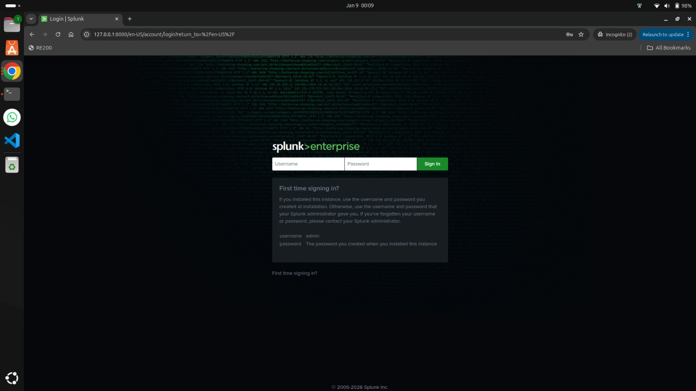

*Figure 1 confirms the BotsV3 VM exists in Oracle VirtualBox.*

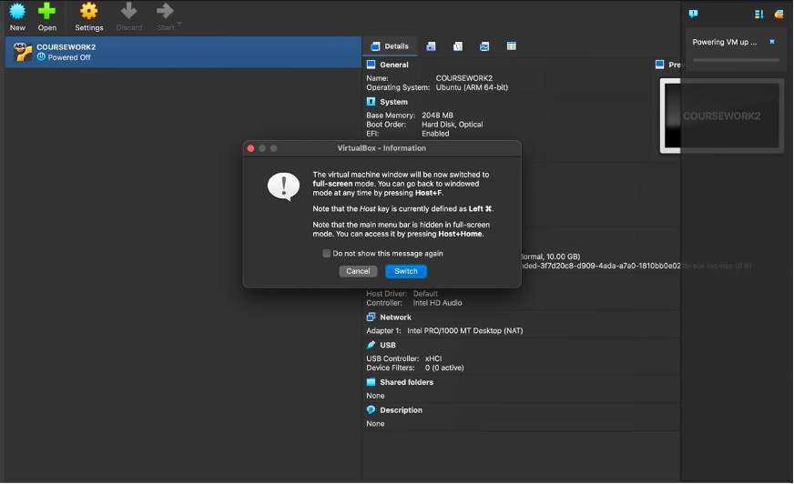
*Figure 2 confirms Splunk is installed and accessible via the local web interface (127.0.0.1:8000), showing operational readiness for search and reporting.*

## 3.2 Dataset onboarding and readiness criteria

BOTSv3 ingestion was performed following the dataset workflow. In a real SOC context, onboarding quality is judged by

events returning under the expected index,

correct sourcetype mapping to enable proper field extraction,

reliable timestamps for timeline analysis, and

consistent field availability (e.g., EventCode, hashes, attachment metadata).

A key point is in SOC investigations, data quality is part of incident quality. If event fields are missing or misparsed, analysts risk false conclusions (e.g., wrong times, wrong users, incorrect host attribution).

## 3.3 Validation and quality checks (SOC-style)

Before answering guided questions, a SOC analyst validates the dataset

Index visibility

```spl
index=botsv3 | head 10
```

Core telemetry presence

```spl
index=botsv3 sourcetype="ms:o365:management" | head 5
index=botsv3 sourcetype="stream:smtp" | head 5
index=botsv3 sourcetype="XmlWinEventLog:Microsoft-Windows-Sysmon/Operational" | head 5
index=botsv3 sourcetype="WinEventLog:Security" | head 5
index=botsv3 sourcetype="osquery:results" | head 5
```

Parsing/field sanity examples

```spl
index=botsv3 sourcetype="WinEventLog:Security" EventCode=4720
| table _time host Account_Name EventCode
index=botsv3 sourcetype="osquery:results"
| table _time host name columns.cmdline columns.uid columns.owner_uid
```

Evidence of successful readiness

The guided question screenshots (Figures 3–10) show events returned for each required sourcetype with meaningful fields displayed, indicating the dataset is usable for investigation.

# 4. Guided Questions

## Q1 — Suspicious User-Agent

Answer
Mozilla/5.0 (X11; U; Linux i686; ko-KP; rv: 19.1br) Gecko/20130508 Fedora/1.9.1-2.5.rs3.0 NaenaraBrowser/3.5b4

**SPL used**

```spl
index=botsv3 sourcetype="ms:o365:management" SourceFileExtension=lnk
```

**Evidence**

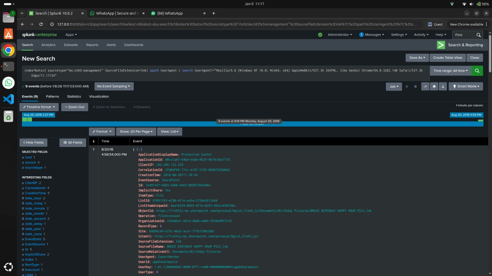

*Figure 3 shows the O365 event and the UA string.*

**Interpretation**

Cloud audit logs indicate access to .lnk objects (shortcuts) within SharePoint/OneDrive. A UA string like NaenaraBrowser is atypical in corporate environments and can represent either attacker tooling, compromised credentials used from an unusual client, or an attempt to blend into unfamiliar UA patterns [8].

**SOC relevance**

Useful for anomaly detection: alert on rare UAs or unusual geographies for the same account.

Enables triage pivots: UA → IP → account → accessed objects → time window.

Supports incident scoping: identify whether the UA appears for multiple accounts or only a single compromised identity.

## Q2 — Malicious attachment filename

Answer
Frothly-Brewery-Financial-Planning-FY2019-Draft.xlsm

**SPL used**

```spl
index=botsv3 sourcetype="stream:smtp" "attach_filename{}"="Malware Alert Text.txt"
```

**Evidence**

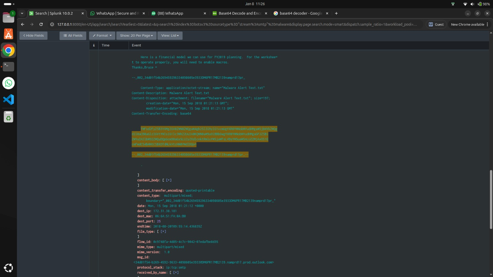

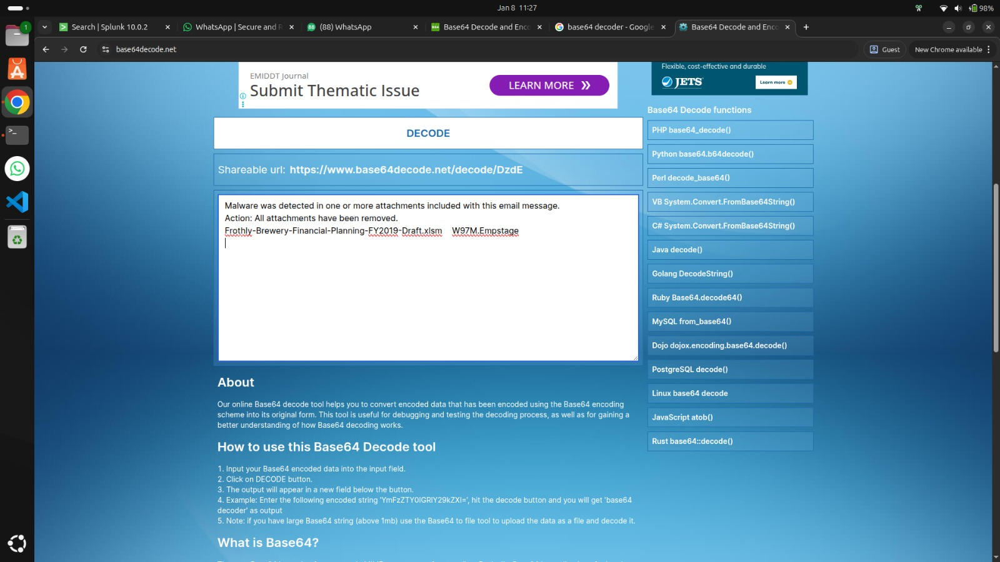

*Figure 4 and 5 shows SMTP attachment evidence.*

**Interpretation**

Email remains one of the most common attack vectors. The query targets attachment patterns and reveals a pathway toward the macro-enabled .xlsm file. Macro-enabled Office documents are often used for code execution via VBA macros or embedded scripts.

**SOC relevance**

Links to delivery in the kill chain.

Drives response playbooks: attachment quarantine, user notification, and retroactive search (“who else received it?”).

Triggers endpoint investigation to confirm whether the file was opened and executed.

## Q3 — Suspicious executable associated with the XLSM event chain

Answer - HxTsr.exe

**SPL used**

```spl
index=botsv3 sourcetype="XmlWinEventLog:Microsoft-Windows-Sysmon/Operational" xlsm
```

**Evidence**

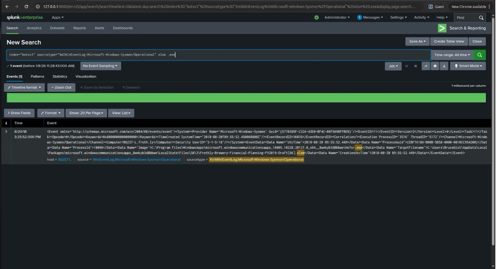

*Figure 6 shows Sysmon context tying XLSM activity to the suspicious process indicator.*

**Interpretation**

Sysmon provides high-fidelity process and file telemetry used heavily in SOC detection engineering [3]. The association of the macro-enabled document chain with the executable HxTsr.exe strongly suggests an execution stage where malicious code drops or launches a payload.

**SOC relevance**

Enables threat hunting: search for HxTsr.exe across hosts and time windows.

Supports containment: isolate the host exhibiting payload execution.

Helps detection building: “Office document opened → unusual executable launched” rules are strong in real environments.

## Q4 — Linux username created (persistence)

Answer - ilovedavidverve

**SPL used**

```spl
index=botsv3 host=hoth sourcetype="osquery:results" useradd "columns.owner_uid"=0
```

**Evidence**

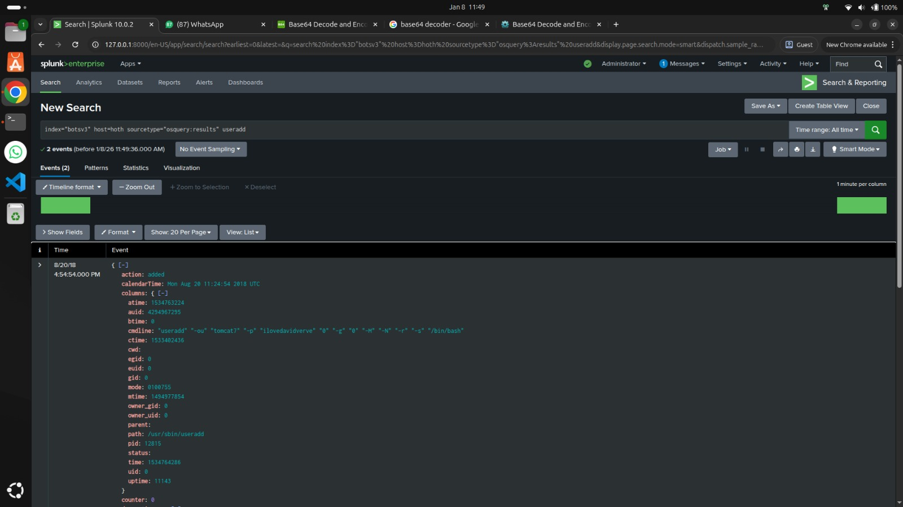

*Figure 7 shows useradd executed with root privileges and the username.*

**Interpretation**

Attackers often establish persistence by creating a new local user on a compromised Linux host. The root context (uid=0) indicates either privilege escalation occurred earlier or the attacker already had privileged access [10].

**SOC relevance**

High-confidence persistence indicator: unauthorized account creation should be an alert.

Drives incident response: remove account, review SSH/auth logs, examine sudo usage, and validate system binaries.

Supports wider hunt: search for the same username or similar useradd patterns across other Linux hosts.

## Q5 — Windows account created

Answer - svcvnc

**SPL used**

```spl
index=botsv3 sourcetype="WinEventLog:Security" EventCode=4720
```

**Evidence**

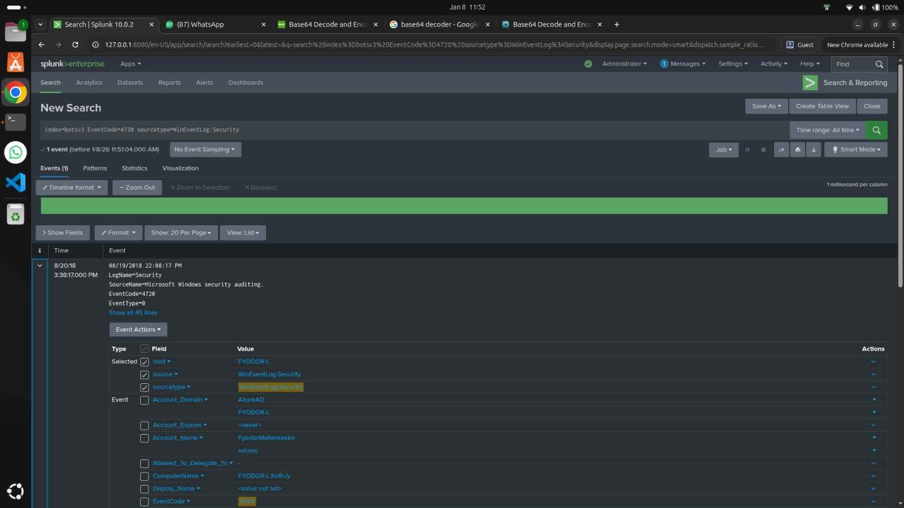

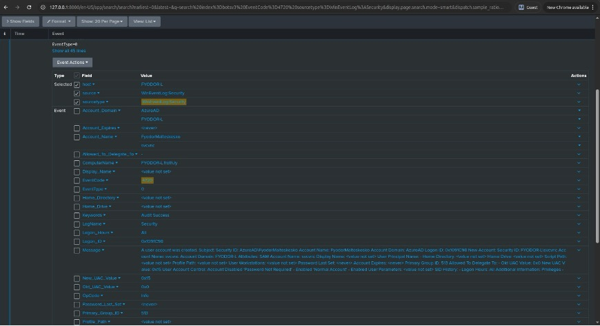

*Figure 8 and 9 show EventCode 4720 and account creation.*

**Interpretation**

Windows auditing event 4720 (“A user account was created”) is a strong security event when it occurs unexpectedly [4]. The name svcvnc resembles a service-related account, a common attacker strategy to reduce suspicion.

**SOC relevance**

Escalation trigger: 4720 should be reviewed, especially outside change windows.

Triage enrichment: identify the creating user, the host, and whether the account logs in later.

Forms part of correlation logic with group membership escalation (Q6).

## Q6 — Groups the Windows account was added to

Answer - administrators,user

**SPL used**

```spl
index=botsv3 sourcetype=WinEventLog:Security (EventCode=4728 OR EventCode=4732 OR EventCode=4756 OR EventCode=4729 OR EventCode=4733 OR EventCode=4757) svcvnc
```

**Evidence**

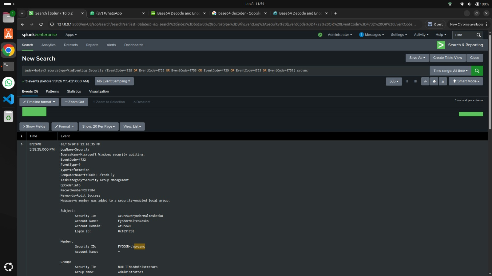

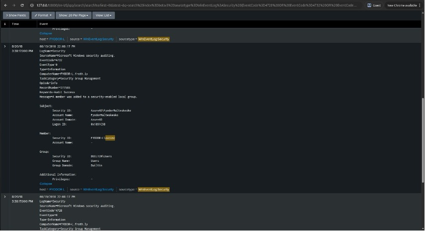


*Figure 10, 11 and 12 shows group membership activity related to svcvnc.*

**Interpretation**

Group membership change events are critical identity telemetry. Addition to Administrators indicates privilege escalation and the ability to perform high-impact actions (disable defenses, create services, dump credentials, etc.) [9].

**SOC relevance**

High severity escalation.

Enables powerful correlation: “new account + admin membership” is rarely benign.

Response action: disable account, remove from admin group, investigate hosts where membership was used.

## Q7 — PID listening on port 1337

Answer - 14356

**SPL used**

```spl
index=botsv3 host=hoth sourcetype=osquery:results 1337 (listening OR LISTEN)
| table _time columns.address columns.port columns.protocol columns.state columns.pid columns.process_name
| sort - _time
```

**Evidence**

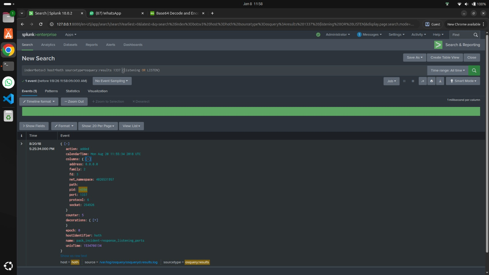

*Figure 13 shows port 1337 listening and the PID.*

**Interpretation**

Listening services on uncommon ports can indicate backdoors or attacker tooling. Binding to 0.0.0.0 increases exposure by accepting connections on all interfaces.

**SOC relevance**

Strong potential C2/persistence indicator.

Next pivots: PID → binary path → hash → parent process.

Detection opportunity: alert on new listening ports or unexpected services, particularly high-risk ports used by known tooling patterns.

## Q8 — MD5 hash

Answer - 586ef56f4d8963dd546163ac31c865d7

**SPL used**

```spl
index=botsv3 sourcetype="XmlWinEventLog:Microsoft-Windows-Sysmon/Operational" "<EventID>1</EventID>" Hashes MD5 host="FYODOR-L"
NOT "C:\\Windows\\system32\\cmd.exe"
NOT "C:\\Windows\\system32\\svchost.exe"
NOT "C:\\Windows\\explorer.exe"
NOT "C:\\Windows\\System32\\WindowsPowerShell\\v1.0\\powershell.exe"
NOT "C:\\Windows\\System32\\services.exe"
NOT "C:\\Windows\\system32\\cleanmgr.exe"
NOT "C:\\Windows\\Temp\\unziped\\lsof-master\\l\\explorer.exe"
svcvnc
```

**Evidence**

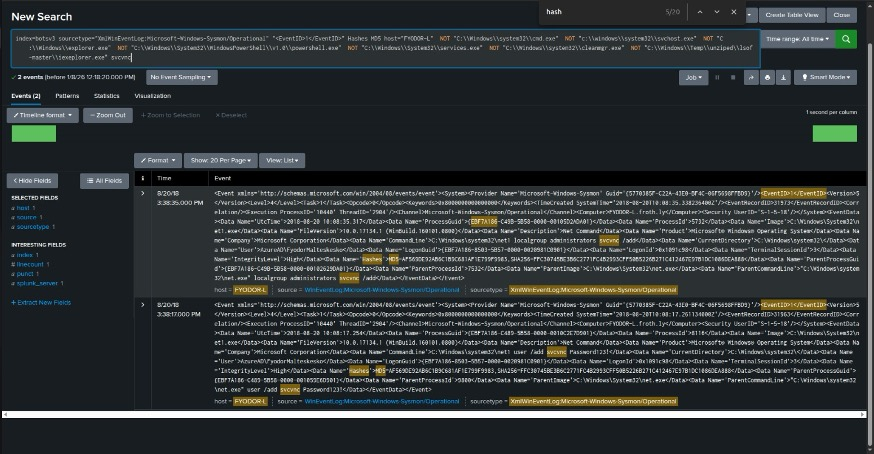

*Figure 14 shows Sysmon process creation event and MD5.*

**Interpretation**

Hashes are practical IoCs for rapid scoping and containment. While MD5 is not collision-resistant, it is still widely used for fast matching and cross-referencing in many SOC workflows.

**SOC relevance**

Hunt: search for the MD5 across all Sysmon events and other telemetry.

Block: EDR hash block (if policy allows) or application control.

Enrich: lookup against threat intelligence to confirm known malware families (where applicable).

## 4.1 Synthesis: Kill-chain narrative and timeline

The combined answers support a coherent incident chain

| Kill-chain phase | Evidence from Q1–Q8 | SOC conclusion |
| --- | --- | --- |
| Cloud anomaly / possible compromised identity | Suspicious O365 UA accessing objects (.lnk) | Early indicator of abnormal access pattern |
| Delivery | Attachment hunting → macro-enabled XLSM | Likely phishing delivery path |
| Execution | HxTsr.exe associated with XLSM chain | Payload execution suspected |
| Persistence (Linux) | Root useradd → ilovedavidverve | Unauthorized local persistence |
| Persistence (Windows) | 4720 → svcvnc created | Unauthorized identity persistence |
| Privilege escalation | Added to Administrators | Elevated control confirms malicious intent |
| C2/remote access | Port 1337 listening (PID 14356) | Potential backdoor or remote control channel |
| IoC extraction | MD5 hash identified | Supports environment-wide scoping and blocking |

This synthesis is important because it shows the SOC “thinking step”: the investigation is not just answering questions, but connecting them into an escalation-worthy incident narrative.

# 5. Conclusion

## 5.1 Conclusion

This BOTSv3 Splunk investigation demonstrates SOC-style detection and incident analysis across cloud, email, endpoint, and identity sources. Findings show: (1) anomalous cloud access indicators via a rare User-Agent, (2) delivery via a macro-enabled spreadsheet, (3) execution evidence via a suspicious executable (HxTsr.exe), (4) persistence via unauthorized account creation on both Linux and Windows, (5) privilege escalation through Administrator group membership, (6) suspicious network behaviour through a listening service on port 1337, and (7) a confirmed MD5 IoC supporting scoping and containment. Together, these artefacts form a credible attacker kill-chain narrative and justify escalation in a real SOC setting.

## 5.2 SOC detection and response improvements

Correlation rule (high confidence)

Trigger a notable event when EventCode 4720 (account created) is followed by 4728/4732/4756 (added to privileged group) within 30–60 minutes, and enrich with creating user + source host.

Cloud anomaly detection

Baseline known UA strings and flag rare UAs accessing SharePoint/OneDrive, especially when paired with unusual file types (e.g., .lnk) or sensitive folders.

Endpoint behaviour detection

Alert on Office macro-enabled documents spawning uncommon executables or command interpreters, using Sysmon process creation + parent/child relationships.

Network hardening

Monitor for new listening ports and services on endpoints, especially when bound to all interfaces. Use osquery or EDR telemetry to alert on uncommon ports (e.g., 1337).

# References

[1] Splunk, “Boss of the SOC (BOTS) Dataset Version 3,” GitHub, Mar. 26, 2022. Available: https://github.com/splunk/botsv3

[2] A. Nelson, S. Rekhi, M. Souppaya, and K. Scarfone, “Incident Response Recommendations and Considerations for Cybersecurity Risk Management”:, NIST, Apr. 2025, doi: https://doi.org/10.6028/nist.sp.800-61r3. Available: https://nvlpubs.nist.gov/nistpubs/SpecialPublications/NIST.SP.800-61r3.pdf

[3] P. Cichonski, T. Millar, T. Grance, and K. Scarfone, “Computer security incident handling guide,” Computer Security Incident Handling Guide, vol. 2, no. 2, Aug. 2021, doi: https://doi.org/10.6028/nist.sp.800-61r2. Available: https://nvlpubs.nist.gov/nistpubs/specialpublications/nist.sp.800-61r2.pdf

[4] Microsoft Sysinternals, “Sysmon - Windows Sysinternals,” learn.microsoft.com, Jul. 23, 2024. Available: https://learn.microsoft.com/en-us/sysinternals/downloads/sysmon

[5] Microsoft, “4720(S) A user account was created. - Windows 10,” learn.microsoft.com, Sep. 07, 2021. Available: https://learn.microsoft.com/en-us/previous-versions/windows/it-pro/windows-10/security/threat-protection/auditing/event-4720

[6] Splunk Ink, “Splunk Docs,” Splunk.com, 2025. Available: https://help.splunk.com/en/splunk-enterprise/spl-search-reference/9.3/introduction/welcome-to-the-search-reference. [Accessed: Jan. 09, 2026]

[7] Aliyefhemin, “Splunk’s Indispensable Role in Modern Security Operations Centers (SOC),” Medium, Jul. 14, 2025. Available: https://medium.com/@aliyefhemin/splunks-indispensable-role-in-modern-security-operations-centers-soc-fcdd4253b240. [Accessed: Jan. 09, 2026]

[8] Walid_Elmorsy, “Microsoft 365 Compliance audit log activities via O365 Management API - Part 1,” TECHCOMMUNITY.MICROSOFT.COM, Nov. 12, 2021. Available: https://techcommunity.microsoft.com/blog/microsoft-security-blog/microsoft-365-compliance-audit-log-activities-via-o365-management-api---part-1/2957171. [Accessed: Jan. 09, 2026]

[9] Microsoft, “Audit Security Group Management - Windows 10,” learn.microsoft.com, Sep. 06, 2021. Available: https://learn.microsoft.com/en-us/previous-versions/windows/it-pro/windows-10/security/threat-protection/auditing/audit-security-group-management

[10] MITRE Corporation, “Create Account, Technique T1136 - Enterprise | MITRE ATT&CK®,” attack.mitre.org, Dec. 14, 2017. Available: https://attack.mitre.org/techniques/T1136/
